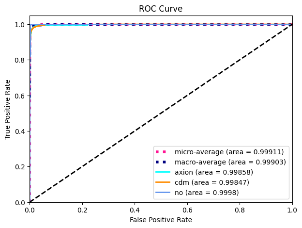

# Dark Matter Substructure Classification via Strong Gravitational Lensing
Strong Gravitational Lensing Hackathon (Task A: Multi-Class Classification)

## Project Overview
This project presents a robust solution for the **Multi-Class Classification** Task of the Strong Gravitational Lensing Hackathon. The challenge focused on identifying the nature of dark matter by classifying simulated strong lensing images into three categories:

* **No Substructure**
* **Cold Dark Matter (CDM) Substructure**
* **Axion Substructure**

The model leverages a customized **ResNet-18 architecture enhanced with Convolutional Block Attention Modules (CBAM)** to achieve near-perfect classification performance on a noisy, grayscale image dataset, demonstrating the potent application of deep learning in astrophysical discovery.

## Key Results
The model achieved state-of-the-art performance on the validation set:

| Metric                 | Score   |
| :--------------------- | :------ |
| Weighted F1-Score      | 0.984   |
| Macro Average ROC AUC  | 0.999   |
| Accuracy               | 0.984   |
| Weighted Precision     | 0.984   |
| Weighted Recall        | 0.984   |

## Technical Implementation
### Features
* **Advanced Architecture:** A ResNet-18 backbone integrated with CBAM attention mechanisms for powerful feature extraction from complex astronomical images.
* **Data Augmentation:** Custom NoisyDataset class implementing additive Gaussian noise to improve model generalization and mimic real observational uncertainties.
* **Robust Evaluation:** Comprehensive metrics including ROC curves, AUC, precision, recall, and F1-score for all classes.

## Model Architecture
The core of our solution is a ResNet-18 model modified for single-channel input and enhanced with **Channel and Spatial Attention Modules (CBAM)**. This allows the model to:
* Learn "what" to look for (Channel Attention).
* Learn "where" to look (Spatial Attention).

This is particularly effective for discerning subtle morphological differences between dark matter substructures in lensing images.

## Results and Analysis
The model's performance is summarized in the ROC curve above and the detailed metrics table. The near-perfect AUC scores indicate excellent separability between all three classes. The high F1-score confirms the model's precision and recall are well-balanced.

## Contributors
* [Ana Araújo](https://github.com/anaaaraujoo)
* [Pedro Jorge](https://github.com/PedroNJorge)
* [Paulo Pinto](https://github.com/diogo-xyz)

## Acknowledgments
* Organizers of the [Strong Gravitational Lensing Hackathon](https://github.com/ML4SCI/DeepLearnHackathon/blob/main/GravitationalLensingChallenge) for providing the dataset and challenge.
* The authors of the [CBAM paper](https://arxiv.org/abs/1807.06521) for their insightful work.
